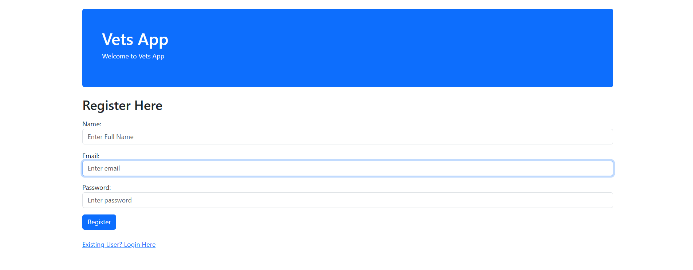
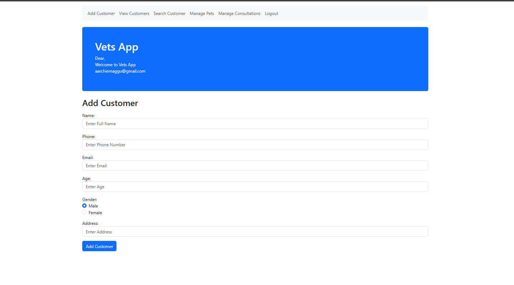
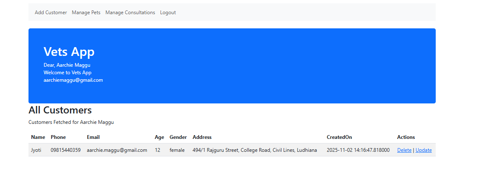
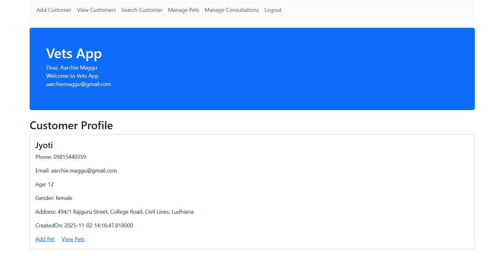

## 🐾 Vets App

**Vets App** is a Python-based application developed to manage and organize veterinary data efficiently.  
It helps automate key veterinary operations and ensures easy data handling for vets and clinics.

---

### ✨ Features

- 📋 **Pet Record Management:** Store and manage detailed information about pets and their owners.  
- 💊 **Medical History Tracking:** Keep track of each animal’s medical and vaccination history.  
- 📅 **Appointment Scheduling:** Simplify booking and reminders for appointments.  
- 🔒 **Secure Storage:** Protect sensitive pet and owner data.  

---

### 🧰 Tech Stack

- 🐍 **Backend:** Python  
- 🗃️ **Database:** MongoDB  
- 💻 **Frontend:** Web-based UI using Flask

---

### ⚙️ Setup & Usage

#### 1️⃣ Clone the repository  
```bash
git clone https://github.com/aarchie-1004/Vets-app.git

```

#### 2️⃣ Navigate into the project directory
```bash
cd Vets-app

```
#### 3️⃣ Install the required dependencies

Make sure you have Python 3 installed, then run:
```bash
pip install -r requirements.txt
```

#### 4️⃣ Run the application

Execute the main script to start the app:
```bash
python session19.py
```

---
### Output










